# [📈 Live Status](https://status.eliodinino.com): <!--live status--> **🟩 All systems operational**

This repository contains the open-source uptime monitor and status page for [Elio Di Nino](eliodinino.com), powered by [Upptime](https://github.com/upptime/upptime).

With [Upptime](https://upptime.js.org), you can get your own unlimited and free uptime monitor and status page, powered entirely by a GitHub repository. We use [Issues](https://github.com/ElioDiNino/status.eliodinino.com/issues) as incident reports, [Actions](https://github.com/ElioDiNino/status.eliodinino.com/actions) as uptime monitors, and [Pages](https://status.eliodinino.com) for the status page.

<!--start: status pages-->
<!-- This summary is generated by Upptime (https://github.com/upptime/upptime) -->
<!-- Do not edit this manually, your changes will be overwritten -->
<!-- prettier-ignore -->
| URL | Status | History | Response Time | Uptime |
| --- | ------ | ------- | ------------- | ------ |
|  [Personal Website](https://eliodinino.com) | 🟩 Up | [personal-website.yml](https://github.com/ElioDiNino/status.eliodinino.com/commits/HEAD/history/personal-website.yml) | 

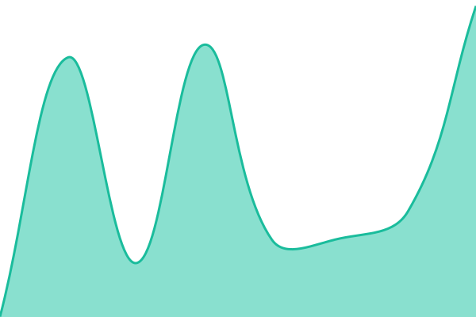 392ms
     
 | 

<a href="https://status.eliodinino.com/history/personal-website">100.00%</a>
    

|  [Personal Website (http)](http://eliodinino.com) | 🟩 Up | [personal-website-http.yml](https://github.com/ElioDiNino/status.eliodinino.com/commits/HEAD/history/personal-website-http.yml) | 

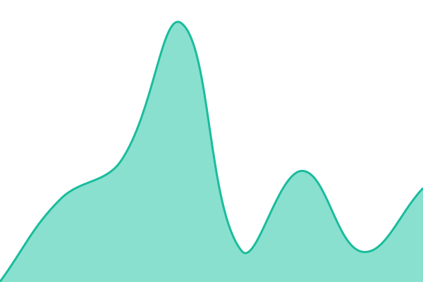 234ms
     
 | 

<a href="https://status.eliodinino.com/history/personal-website-http">100.00%</a>
    

|  [Personal Website (IPv4 - 443)](eliodinino.com) | 🟩 Up | [personal-website-i-pv4-443.yml](https://github.com/ElioDiNino/status.eliodinino.com/commits/HEAD/history/personal-website-i-pv4-443.yml) | 

 20ms
     
 | 

<a href="https://status.eliodinino.com/history/personal-website-i-pv4-443">100.00%</a>
    

|  [Personal Website (IPv4 - 80)](eliodinino.com) | 🟩 Up | [personal-website-i-pv4-80.yml](https://github.com/ElioDiNino/status.eliodinino.com/commits/HEAD/history/personal-website-i-pv4-80.yml) | 

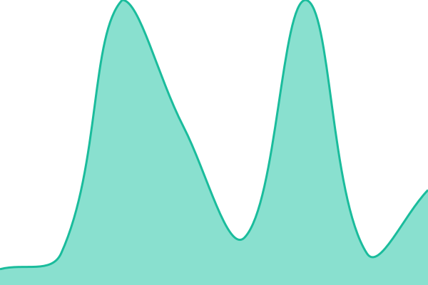 19ms
     
 | 

<a href="https://status.eliodinino.com/history/personal-website-i-pv4-80">100.00%</a>
    

|  [Personal Website (www - IPv4 - 443)](www.eliodinino.com) | 🟩 Up | [personal-website-www-i-pv4-443.yml](https://github.com/ElioDiNino/status.eliodinino.com/commits/HEAD/history/personal-website-www-i-pv4-443.yml) | 

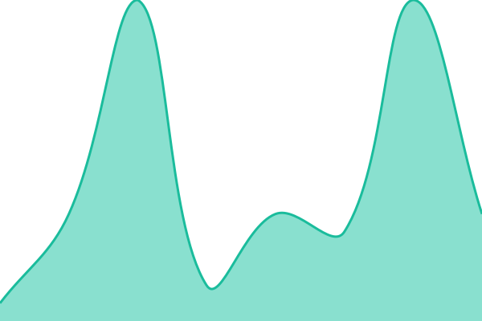 9ms
     
 | 

<a href="https://status.eliodinino.com/history/personal-website-www-i-pv4-443">100.00%</a>
    

|  [Personal Website (www - IPv4 - 80)](www.eliodinino.com) | 🟩 Up | [personal-website-www-i-pv4-80.yml](https://github.com/ElioDiNino/status.eliodinino.com/commits/HEAD/history/personal-website-www-i-pv4-80.yml) | 

 12ms
     
 | 

<a href="https://status.eliodinino.com/history/personal-website-www-i-pv4-80">100.00%</a>
    

|  [Personal Links Redirect (links)](https://links.eliodinino.com) | 🟩 Up | [personal-links-redirect-links.yml](https://github.com/ElioDiNino/status.eliodinino.com/commits/HEAD/history/personal-links-redirect-links.yml) | 

 404ms
     
 | 

<a href="https://status.eliodinino.com/history/personal-links-redirect-links">100.00%</a>
    

|  [Personal Links Redirect (links - IPv4 - 443)](links.eliodinino.com) | 🟩 Up | [personal-links-redirect-links-i-pv4-443.yml](https://github.com/ElioDiNino/status.eliodinino.com/commits/HEAD/history/personal-links-redirect-links-i-pv4-443.yml) | 

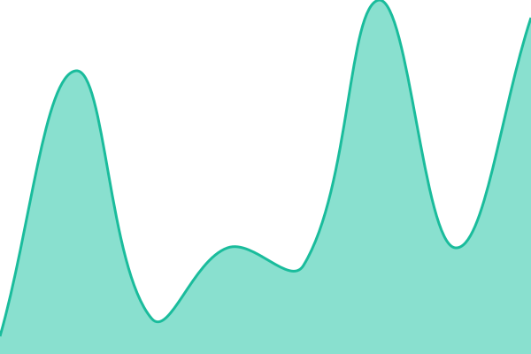 8ms
     
 | 

<a href="https://status.eliodinino.com/history/personal-links-redirect-links-i-pv4-443">100.00%</a>
    

|  [Personal Links Redirect (links - IPv4 - 80)](links.eliodinino.com) | 🟩 Up | [personal-links-redirect-links-i-pv4-80.yml](https://github.com/ElioDiNino/status.eliodinino.com/commits/HEAD/history/personal-links-redirect-links-i-pv4-80.yml) | 

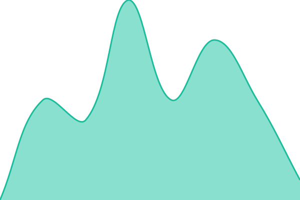 9ms
     
 | 

<a href="https://status.eliodinino.com/history/personal-links-redirect-links-i-pv4-80">100.00%</a>
    

|  [Personal Links Redirect (bio)](https://bio.eliodinino.com) | 🟩 Up | [personal-links-redirect-bio.yml](https://github.com/ElioDiNino/status.eliodinino.com/commits/HEAD/history/personal-links-redirect-bio.yml) | 

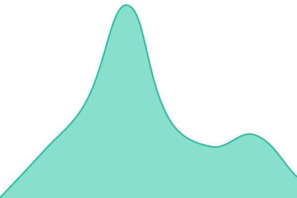 243ms
     
 | 

<a href="https://status.eliodinino.com/history/personal-links-redirect-bio">100.00%</a>
    

|  [Personal Links Redirect (bio - IPv4 - 443)](bio.eliodinino.com) | 🟩 Up | [personal-links-redirect-bio-i-pv4-443.yml](https://github.com/ElioDiNino/status.eliodinino.com/commits/HEAD/history/personal-links-redirect-bio-i-pv4-443.yml) | 

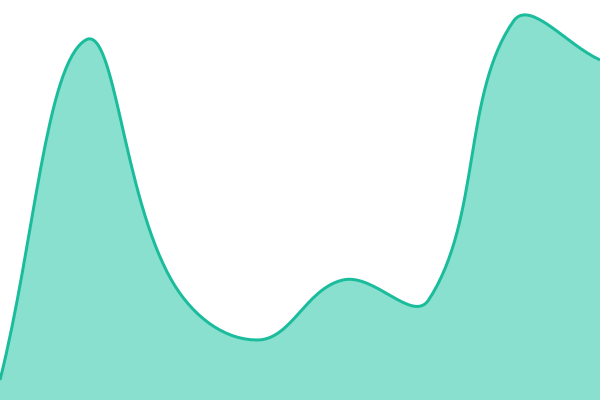 8ms
     
 | 

<a href="https://status.eliodinino.com/history/personal-links-redirect-bio-i-pv4-443">100.00%</a>
    

|  [Personal Links Redirect (bio - IPv4 - 80)](bio.eliodinino.com) | 🟩 Up | [personal-links-redirect-bio-i-pv4-80.yml](https://github.com/ElioDiNino/status.eliodinino.com/commits/HEAD/history/personal-links-redirect-bio-i-pv4-80.yml) | 

 22ms
     
 | 

<a href="https://status.eliodinino.com/history/personal-links-redirect-bio-i-pv4-80">100.00%</a>
    

|  [Photography Website Redirect](https://photography.eliodinino.com) | 🟩 Up | [photography-website-redirect.yml](https://github.com/ElioDiNino/status.eliodinino.com/commits/HEAD/history/photography-website-redirect.yml) | 

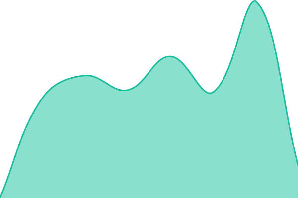 1033ms
     
 | 

<a href="https://status.eliodinino.com/history/photography-website-redirect">97.95%</a>
    

|  [Photography Website](https://eliodinino.wixsite.com/photography/) | 🟩 Up | [photography-website.yml](https://github.com/ElioDiNino/status.eliodinino.com/commits/HEAD/history/photography-website.yml) | 

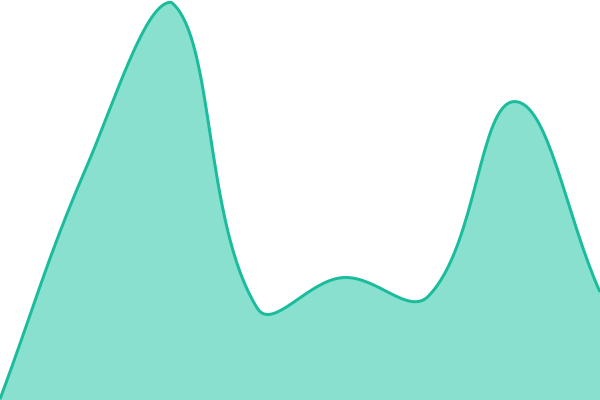 376ms
     
 | 

<a href="https://status.eliodinino.com/history/photography-website">98.58%</a>
    

|  [Homelab Landing Page](https://internal.eliodinino.com) | 🟩 Up | [homelab-landing-page.yml](https://github.com/ElioDiNino/status.eliodinino.com/commits/HEAD/history/homelab-landing-page.yml) | 

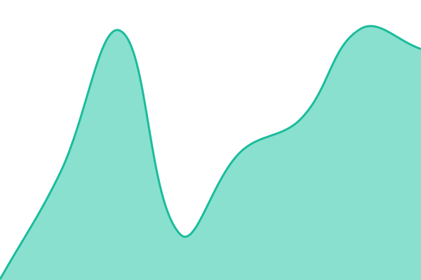 216ms
     
 | 

<a href="https://status.eliodinino.com/history/homelab-landing-page">100.00%</a>
    

|  [Homelab Landing Page (http)](http://internal.eliodinino.com) | 🟩 Up | [homelab-landing-page-http.yml](https://github.com/ElioDiNino/status.eliodinino.com/commits/HEAD/history/homelab-landing-page-http.yml) | 

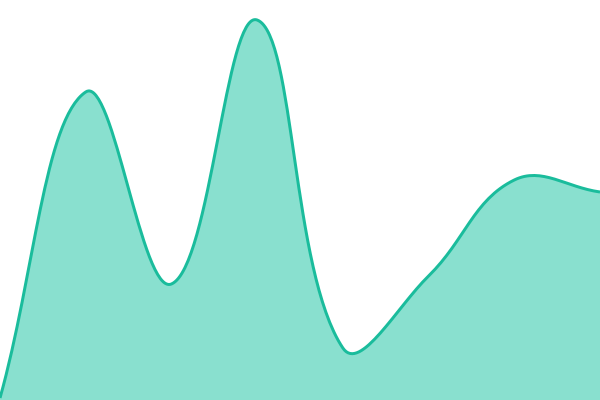 152ms
     
 | 

<a href="https://status.eliodinino.com/history/homelab-landing-page-http">100.00%</a>
    

|  [MTA-STS Policy Site](https://mta-sts.eliodinino.com) | 🟩 Up | [mta-sts-policy-site.yml](https://github.com/ElioDiNino/status.eliodinino.com/commits/HEAD/history/mta-sts-policy-site.yml) | 

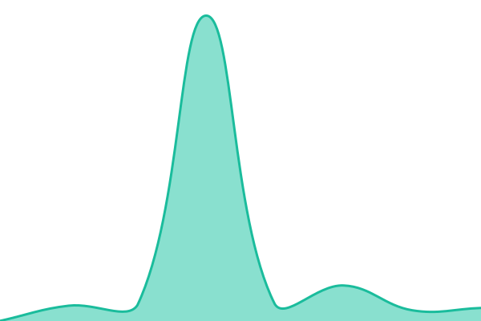 170ms
     
 | 

<a href="https://status.eliodinino.com/history/mta-sts-policy-site">100.00%</a>
    

|  [PGP Security Key Redirect](https://pgp.eliodinino.com) | 🟩 Up | [pgp-security-key-redirect.yml](https://github.com/ElioDiNino/status.eliodinino.com/commits/HEAD/history/pgp-security-key-redirect.yml) | 

 778ms
     
 | 

<a href="https://status.eliodinino.com/history/pgp-security-key-redirect">100.00%</a>
    

|  [PGP Security Key](https://keys.openpgp.org/search?q=security%40eliodinino.com) | 🟩 Up | [pgp-security-key.yml](https://github.com/ElioDiNino/status.eliodinino.com/commits/HEAD/history/pgp-security-key.yml) | 

 438ms
     
 | 

<a href="https://status.eliodinino.com/history/pgp-security-key">100.00%</a>
    

|  [GitHub Profile](https://github.com/ElioDiNino) | 🟩 Up | [git-hub-profile.yml](https://github.com/ElioDiNino/status.eliodinino.com/commits/HEAD/history/git-hub-profile.yml) | 

 619ms
     
 | 

<a href="https://status.eliodinino.com/history/git-hub-profile">100.00%</a>
    

|  [GitHub Profile (www)](https://www.github.com/ElioDiNino) | 🟩 Up | [git-hub-profile-www.yml](https://github.com/ElioDiNino/status.eliodinino.com/commits/HEAD/history/git-hub-profile-www.yml) | 

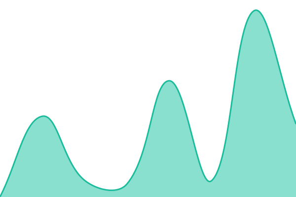 611ms
     
 | 

<a href="https://status.eliodinino.com/history/git-hub-profile-www">100.00%</a>
    

|  [Personal Health Website](https://health.eliodinino.com) | 🟩 Up | [personal-health-website.yml](https://github.com/ElioDiNino/status.eliodinino.com/commits/HEAD/history/personal-health-website.yml) | 

 180ms
     
 | 

<a href="https://status.eliodinino.com/history/personal-health-website">100.00%</a>
    

<!--end: status pages-->

[**Visit our status website →**](https://status.eliodinino.com)

## 📄 License

- Powered by: [Upptime](https://github.com/upptime/upptime)
- Code: [MIT](./LICENSE) © [Anand Chowdhary](https://anandchowdhary.com), supported by [Pabio](https://pabio.com)
- Data in the `./history` directory: [Open Database License](https://opendatacommons.org/licenses/odbl/1-0/)
