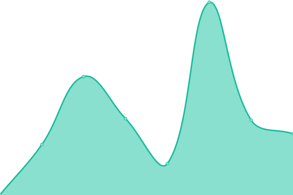
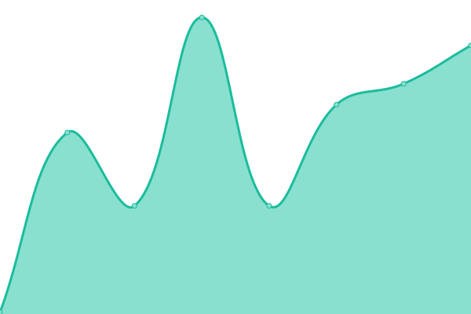

# [📈 Live Status](https://status.eliodinino.com): <!--live status--> **🟧 Partial outage**

This repository contains the open-source uptime monitor and status page for [Elio Di Nino](eliodinino.com), powered by [Upptime](https://github.com/upptime/upptime).

With [Upptime](https://upptime.js.org), you can get your own unlimited and free uptime monitor and status page, powered entirely by a GitHub repository. We use [Issues](https://github.com/ElioDiNino/status.eliodinino.com/issues) as incident reports, [Actions](https://github.com/ElioDiNino/status.eliodinino.com/actions) as uptime monitors, and [Pages](https://status.eliodinino.com) for the status page.

<!--start: status pages-->
<!-- This summary is generated by Upptime (https://github.com/upptime/upptime) -->
<!-- Do not edit this manually, your changes will be overwritten -->
<!-- prettier-ignore -->
| URL | Status | History | Response Time | Uptime |
| --- | ------ | ------- | ------------- | ------ |
|  [Personal Website](https://eliodinino.com) | 🟩 Up | [personal-website.yml](https://github.com/ElioDiNino/status.eliodinino.com/commits/HEAD/history/personal-website.yml) | 

 202ms
     
 | 

<a href="https://status.eliodinino.com/history/personal-website">100.00%</a>
    

|  [Personal Website (www)](https://www.eliodinino.com) | 🟥 Down | [personal-website-www.yml](https://github.com/ElioDiNino/status.eliodinino.com/commits/HEAD/history/personal-website-www.yml) | 

 157ms
     
 | 

<a href="https://status.eliodinino.com/history/personal-website-www">95.37%</a>
    

|  [Personal Links Redirect (links)](https://links.eliodinino.com) | 🟥 Down | [personal-links-redirect-links.yml](https://github.com/ElioDiNino/status.eliodinino.com/commits/HEAD/history/personal-links-redirect-links.yml) | 

 142ms
     
 | 

<a href="https://status.eliodinino.com/history/personal-links-redirect-links">96.65%</a>
    

|  [Personal Links Redirect (bio)](https://bio.eliodinino.com) | 🟩 Up | [personal-links-redirect-bio.yml](https://github.com/ElioDiNino/status.eliodinino.com/commits/HEAD/history/personal-links-redirect-bio.yml) | 

 132ms
     
 | 

<a href="https://status.eliodinino.com/history/personal-links-redirect-bio">100.00%</a>
    

|  [Photography Website Redirect](https://photography.eliodinino.com) | 🟩 Up | [photography-website-redirect.yml](https://github.com/ElioDiNino/status.eliodinino.com/commits/HEAD/history/photography-website-redirect.yml) | 

 371ms
     
 | 

<a href="https://status.eliodinino.com/history/photography-website-redirect">100.00%</a>
    

|  [Photography Website](https://eliodinino.wixsite.com/photography/) | 🟩 Up | [photography-website.yml](https://github.com/ElioDiNino/status.eliodinino.com/commits/HEAD/history/photography-website.yml) | 

 148ms
     
 | 

<a href="https://status.eliodinino.com/history/photography-website">100.00%</a>
    

|  [MTA-STS Policy Site](https://mta-sts.eliodinino.com) | 🟩 Up | [mta-sts-policy-site.yml](https://github.com/ElioDiNino/status.eliodinino.com/commits/HEAD/history/mta-sts-policy-site.yml) | 

 69ms
     
 | 

<a href="https://status.eliodinino.com/history/mta-sts-policy-site">100.00%</a>
    

|  [GitHub Profile](https://github.com/ElioDiNino) | 🟩 Up | [git-hub-profile.yml](https://github.com/ElioDiNino/status.eliodinino.com/commits/HEAD/history/git-hub-profile.yml) | 

 478ms
     
 | 

<a href="https://status.eliodinino.com/history/git-hub-profile">100.00%</a>
    

|  [GitHub Profile (www)](https://www.github.com/ElioDiNino) | 🟩 Up | [git-hub-profile-www.yml](https://github.com/ElioDiNino/status.eliodinino.com/commits/HEAD/history/git-hub-profile-www.yml) | 

 65ms
     
 | 

<a href="https://status.eliodinino.com/history/git-hub-profile-www">100.00%</a>
    

|  [Personal Health Website](https://health.eliodinino.com) | 🟩 Up | [personal-health-website.yml](https://github.com/ElioDiNino/status.eliodinino.com/commits/HEAD/history/personal-health-website.yml) | 

 83ms
     
 | 

<a href="https://status.eliodinino.com/history/personal-health-website">100.00%</a>
    

|  [Advanced RPAS Page](https://tc.canada.ca/en/aviation/drone-safety/drone-pilot-licensing/getting-drone-pilot-certificate) | 🟩 Up | [advanced-rpas-page.yml](https://github.com/ElioDiNino/status.eliodinino.com/commits/HEAD/history/advanced-rpas-page.yml) | 

 170ms
     
 | 

<a href="https://status.eliodinino.com/history/advanced-rpas-page">100.00%</a>
    

<!--end: status pages-->

[**Visit our status website →**](https://status.eliodinino.com)

## 📄 License

- Powered by: [Upptime](https://github.com/upptime/upptime)
- Code: [MIT](./LICENSE) © [Anand Chowdhary](https://anandchowdhary.com), supported by [Pabio](https://pabio.com)
- Data in the `./history` directory: [Open Database License](https://opendatacommons.org/licenses/odbl/1-0/)
